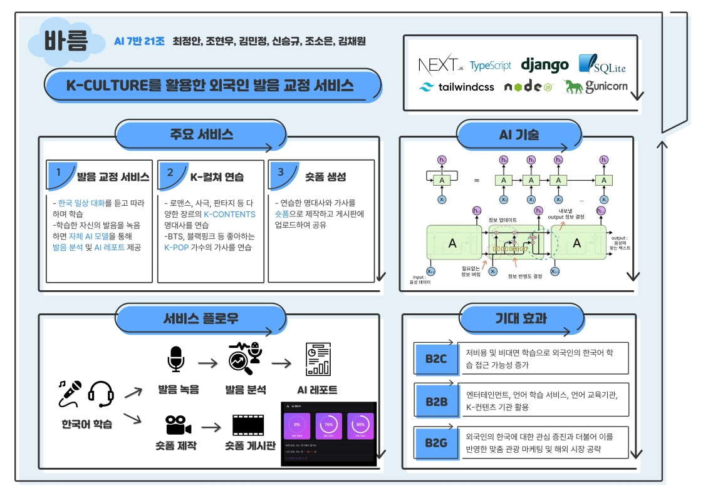

# Aivle 4기 21조 빅프로젝트 "바름" Backend Part

   
  
   

## 프로젝트 소개

AivleSchool 4기 충남/충북 7반 21조 빅프로젝트

 

## 기술 스택

 

## 구현 기능

### 회원가입 및 로그인

### 마이페이지

### 공지 게시판 및 댓글

### 음성녹음파일 업로드 및 AI 평가

### 쇼츠 게시판 및 댓글

 

## 배운 점 & 아쉬운 점

 

## 라이센스

이 프로젝트는 Unlicense 라이선스에 따라 사용이 허가됩니다.
 이는 여러분이 이 프로젝트를 어떤 목적으로든지 제약 없이 사용할 수 있음을 의미합니다.
 자세한 내용은 [여기](http://unlicense.org)를 참조하세요.

<!-- Stack Icon Refernces -->

[js]: /images/stack/javascript.svg
[ts]: /images/stack/typescript.svg
[react]: /images/stack/react.svg
[node]: /images/stack/node.svg
